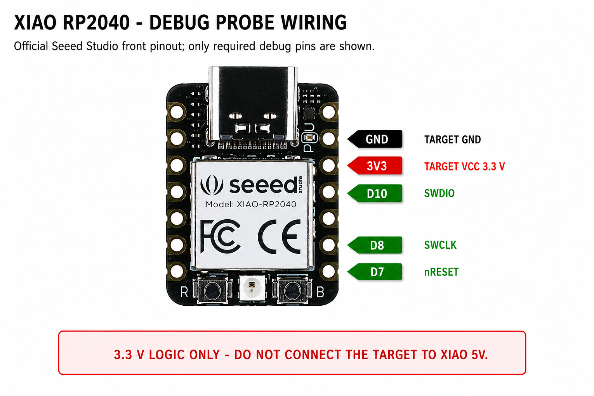

# Debugprobe

Firmware source for the Raspberry Pi Debug Probe SWD/UART accessory. Can also be run on a Raspberry Pi Pico or Pico 2.

This fork additionally contains a configuration for **Seeed Studio XIAO RP2040** intended for CMSIS-DAP SWD programming, including a dedicated target reset line.

[Raspberry Pi Debug Probe product page](https://www.raspberrypi.com/products/debug-probe/)

[Raspberry Pi Pico product page](https://www.raspberrypi.com/products/raspberry-pi-pico/)

[Raspberry Pi Pico 2 product page](https://www.raspberrypi.com/products/raspberry-pi-pico-2/)

## Seeed Studio XIAO RP2040

The `xiao-rp2040-reset` configuration uses the pin names printed/documented by Seeed Studio:

| XIAO pin | RP2040 GPIO | Debug Probe function | Connect to target |
| --- | ---: | --- | --- |
| **D7** | GPIO1 | Target reset | **nRESET** |
| **D8** | GPIO2 | SWD clock | **SWCLK** |
| **D10** | GPIO3 | SWD data | **SWDIO** |
| **GND** | - | Ground | **GND** |
| **3V3** | - | 3.3 V supply | **VCC / 3.3 V** |



The diagram follows the official Seeed Studio XIAO RP2040 front-pinout naming. The official reference image is available from [Seeed Studio](https://files.seeedstudio.com/wiki/XIAO-RP2040/img/XIAO_RP2040_front_pinout.png), and the board documentation is on the [Seeed Studio XIAO RP2040 wiki](https://wiki.seeedstudio.com/XIAO-RP2040/).

> **Important:** the target interface is 3.3 V. Do **not** connect the target to the XIAO `5V` pin.

For the Solum M3 recovery use case only five connections are required: `D7/nRESET`, `D8/SWCLK`, `D10/SWDIO`, `GND`, and `3V3`. The CDC UART bridge remains assigned internally to GPIO4/GPIO5 because the upstream Debug Probe source currently compiles the UART component, but those UART pins are not required for SWD programming.

### Building the XIAO firmware

The GitHub Actions workflow in this fork builds the XIAO RP2040 firmware automatically. The expected UF2 output is:

```text
debugprobe_on_xiao_rp2040.uf2
```

To install it, put the XIAO RP2040 into its UF2 bootloader mode so that Windows exposes the `RPI-RP2` drive, then copy the UF2 file to that drive. After reboot the board enumerates as a CMSIS-DAP Debug Probe.

## Documentation

Debug Probe documentation can be found at the [Raspberry Pi documentation](https://www.raspberrypi.com/documentation/microcontrollers/debug-probe.html#about-the-debug-probe) and in the [Getting Started with Pico PDF](https://pip.raspberrypi.com/documents/RP-008276-DS).

## Hacking

For the purpose of making changes or studying of the code, you may want to compile the code yourself.

First, clone the repository:
```bash
git clone https://github.com/raspberrypi/debugprobe
cd debugprobe
```

Initialize and update the submodules:
```bash
 git submodule update --init --recursive
```

Then create and switch to the build directory:
```bash
 mkdir build
 cd build
```

If your environment doesn't contain `PICO_SDK_PATH`, then either add it to your environment variables with `export PICO_SDK_PATH=/path/to/sdk` or add `-DPICO_SDK_PATH=/path/to/sdk` to the arguments to CMake below.

Run cmake and build the code:
```bash
 cmake ..
 make
```

Done! You should now have a `debugprobe.uf2` that you can upload to your Debug Probe via the UF2 bootloader.

## Building for the Pico 1

If you want to create the version that runs on the Pico, then you need to invoke `cmake` in the sequence above with the `DEBUG_ON_PICO=ON` option:
```bash
cmake -DDEBUG_ON_PICO=ON ..
```

This will build with the configuration for the Pico and call the output program `debugprobe_on_pico.uf2`, as opposed to `debugprobe.uf2` for the accessory hardware.

Note that if you first ran through the whole sequence to compile for the Debug Probe, then you don't need to start back at the top. You can just go back to the `cmake` step and start from there.

## Building for the Pico 2

If using an existing debugprobe clone:
- You must completely regenerate your build directory, or use a different one.
- You must also sync and update submodules.
- `PICO_SDK_PATH` must point to a version 2.0.0 or greater install.

```bash
git submodule sync
git submodule update --init --recursive
mkdir build-pico2
cd build-pico2
cmake -DDEBUG_ON_PICO=1 -DPICO_BOARD=pico2 ../
```

This will build with the configuration for the Pico 2 and call the output program `debugprobe_on_pico2.uf2`.

## AutoBaud Mode

Mode which automatically detects and sets the UART baud rate as data arrives.

To enable AutoBaud, configure the USB CDC port to the following custom baud rate:
```
9728 (0x2600)
```
> **Note:** Some Linux serial tools cannot set custom baud values. PuTTY on Windows and any terminal that supports arbitrary baud rates works.

Changing the baud rate to any other value disables AutoBaud.
